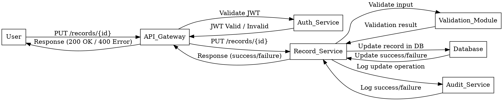
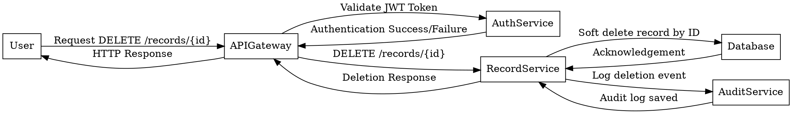

```dot
digraph SequenceDiagram {
    rankdir=LR;
    node [shape=record, fontname=Arial];

    User -> Frontend [label="1. Sends HTTP GET /records request"];
    Frontend -> APIGateway [label="2. Forwards request via API Gateway"];
    APIGateway -> AuthService [label="3. Validates JWT Token"];
    AuthService -> APIGateway [label="4. Returns authentication status"];
    APIGateway -> Backend [label="5. Routes authenticated request to Backend"];
    Backend -> ServiceLayer [label="6. Processes business logic for fetching records"];
    ServiceLayer -> RepositoryLayer [label="7. Queries the database"];
    RepositoryLayer -> Database [label="8. Executes SQL query"];
    Database -> RepositoryLayer [label="9. Returns query results"];
    RepositoryLayer -> ServiceLayer [label="10. Sends processed data"];
    ServiceLayer -> Backend [label="11. Returns response"];
    Backend -> APIGateway [label="12. Forwards response"];
    APIGateway -> Frontend [label="13. Sends response to client"];
    Frontend -> User [label="14. Displays record data"];
}
```

Here's the revised version of the sequence diagram that incorporates an **API Gateway** for authentication and service routing, following the **API Gateway/Service Mesh design pattern**:

---

---

### **Key Updates and Rationale:**
1. **API Gateway Integration:**
   - The **API Gateway** serves as the entry point for all client requests, handling routing, authentication, and rate-limiting.
   - It interacts with the **AuthService** to validate the JWT token instead of the **Backend** directly. This decouples authentication from the backend, improving scalability and enabling centralised security management.

2. **Backend Simplification:**
   - By offloading authentication and request validation to the API Gateway, the **Backend** can focus solely on processing business logic and handling data operations.

3. **Scalability and Extensibility:**
   - The API Gateway can integrate with a Service Mesh for load balancing, service discovery, and observability, ensuring seamless scaling as the application grows.

If this architecture aligns with your goals, it provides a solid foundation for security, scalability, and maintainability. Let me know if you'd like further adjustments or explanations!
___

Here’s the sequence diagram for the **"Create Record"** operation, represented in Graphviz DOT language:

```dot
digraph G {
  rankdir=LR;
  node [shape=rectangle, style=filled, fillcolor=lightblue];

  User [label="User (Frontend)"];
  Frontend [label="Frontend (React App)"];
  APIGateway [label="API Gateway"];
  Controller [label="RecordController (Spring Boot)"];
  Service [label="RecordService (Spring Boot)"];
  Repository [label="RecordRepository (Hibernate/JPA)"];
  Database [label="Database"];

  User -> Frontend [label="Fill and Submit Record Form"];
  Frontend -> APIGateway [label="POST /records"];
  APIGateway -> Controller [label="POST /records"];
  Controller -> Service [label="Validate Request"];
  Service -> Repository [label="Save Record to Database"];
  Repository -> Database [label="Insert Query"];
  Database -> Repository [label="Success"];
  Repository -> Service [label="Saved Entity"];
  Service -> Controller [label="Response with Created Record"];
  Controller -> APIGateway [label="HTTP 201 (Created)"];
  APIGateway -> Frontend [label="Response to User"];
  Frontend -> User [label="Show Success Message"];
}
```

### Key Features of the Diagram:
1. **Frontend Layer:** User fills out a form and submits it through the React app.
2. **API Gateway:** Serves as the secure entry point to the backend.
3. **Backend Logic:**
   - The `RecordController` processes the request.
   - The `RecordService` validates and applies business rules.
   - The `RecordRepository` performs the actual database operation via Hibernate/JPA.
4. **Database Layer:** Handles the insertion of the record and returns success.
5. **Response Flow:** Acknowledgment is sent back through the layers, ultimately notifying the user.

Would you like me to render this as an image or help integrate it into documentation?
___

Here is the sequence diagram for the **"Get Record by ID"** API under the Record CRUD APIs, considering the API Gateway/Service Mesh design pattern for authentication and routing.

---

### **Sequence Diagram (Description)**

1. **User** sends a `GET /records/{id}` request to the **API Gateway**.  
2. **API Gateway**:
   - Verifies the JWT token for authentication.
   - Checks the user's roles and permissions for authorization.
   - Routes the request to the **Record Management Service**.
3. **Record Management Service**:
   - Passes the request to the **Controller Layer**.
   - The **Controller Layer** calls the **Service Layer** for business logic execution.
4. **Service Layer**:
   - Fetches the record by ID using the **Repository Layer**.
5. **Repository Layer**:
   - Queries the database for the requested record.
6. The **Database** returns the record to the **Repository Layer**, which passes it back to the **Service Layer**.
7. **Service Layer** performs any additional data formatting and validation and returns the record to the **Controller Layer**.
8. **Controller Layer** sends the formatted response back to the **API Gateway**.
9. **API Gateway** sends the response to the **User**.

---

### **Graphviz Dot Code for the Sequence Diagram**

```dot
digraph SequenceDiagram {
    rankdir=LR;
    node [shape=box];

    User [label="User"];
    APIGateway [label="API Gateway"];
    RecordService [label="Record Management Service"];
    Controller [label="Controller Layer"];
    ServiceLayer [label="Service Layer"];
    Repository [label="Repository Layer"];
    Database [label="Database"];

    User -> APIGateway [label="GET /records/{id}"];
    APIGateway -> APIGateway [label="Authenticate & Authorize (JWT)"];
    APIGateway -> RecordService [label="Forward Request"];
    RecordService -> Controller [label="Handle Request"];
    Controller -> ServiceLayer [label="Get Record by ID"];
    ServiceLayer -> Repository [label="Query Record"];
    Repository -> Database [label="SELECT * FROM records WHERE id = ?"];
    Database -> Repository [label="Record Data"];
    Repository -> ServiceLayer [label="Return Record"];
    ServiceLayer -> Controller [label="Return Response"];
    Controller -> RecordService [label="Response"];
    RecordService -> APIGateway [label="Return Response"];
    APIGateway -> User [label="Record Data (Response)"];
}
```

---

You can use tools like [Graphviz](https://graphviz.org/) or online tools like [WebGraphviz](http://www.webgraphviz.com/) to visualize this diagram. Let me know if you need the diagram generated or refined further!
___

Here is the sequence diagram in Graphviz Dot Language for the **Update Record** API under "Record CRUD APIs":  

### Explanation:
1. **User:** Initiates the update request with valid credentials.
2. **API Gateway:** Handles authentication and routes the request.
3. **Auth Service:** Validates the user's JWT for security.
4. **Record Service:** Processes the update request and interacts with:
   - **Validation Module**: Ensures the input data is valid.
   - **Database**: Updates the record in persistent storage.
5. **Audit Service:** Logs the operation for compliance and traceability.
6. **Responses:** Success or failure messages are returned to the user.
___

Here is the sequence diagram for the "Delete Record" operation under "Record CRUD APIs," represented using Graphviz DOT language:

### Diagram Description:
1. **User** initiates the "Delete Record" operation by sending a `DELETE /records/{id}` request to the **API Gateway**.
2. The **API Gateway** validates the JWT token with the **AuthService**.
3. Upon successful authentication, the **API Gateway** forwards the request to the **RecordService**.
4. The **RecordService** performs a soft delete operation in the **Database** (e.g., marks the record as inactive without actual deletion).
5. The **Database** acknowledges the operation back to the **RecordService**.
6. The **RecordService** logs the deletion event by communicating with the **AuditService**.
7. The **AuditService** confirms the audit log is saved.
8. Finally, the **RecordService** sends the deletion response to the **API Gateway**, which forwards it back to the **User**.
___

