Below is the sequence diagram for the "Search Record" API (`GET /records/search`) using Graphviz Dot Language:

```dot
digraph SearchRecordSequence {
    rankdir=LR;
    node [shape=rect, fontname="Arial"];

    Client [label="Client (Frontend)"];
    APIGateway [label="API Gateway"];
    RecordService [label="Record Management Service"];
    Database [label="Database"];

    Client -> APIGateway [label="GET /records/search?filters"];
    APIGateway -> RecordService [label="Forward request with filters"];
    RecordService -> Database [label="Query with filters"];
    Database -> RecordService [label="Return filtered results"];
    RecordService -> APIGateway [label="Send results"];
    APIGateway -> Client [label="Return results"];
}
```

### Explanation of the Sequence
1. **Client Request**: The client sends a `GET /records/search` request with appropriate filters as query parameters to the **API Gateway**.
2. **Gateway Forwarding**: The **API Gateway** authenticates and validates the request, then forwards it to the **Record Management Service**.
3. **Service Querying**: The **Record Management Service** queries the **Database** using the provided filters.
4. **Database Response**: The **Database** returns the filtered results to the **Record Management Service**.
5. **Service Processing**: The **Record Management Service** processes and formats the results (if necessary) and sends them back to the **API Gateway**.
6. **Gateway Response**: The **API Gateway** returns the final results to the **Client**.

Let me know if you'd like me to create a rendered diagram or make adjustments.
___

```dot
digraph FilterRecordsByType {
    rankdir=LR;
    node [shape=rectangle];

    User [label="User"];
    APIGateway [label="API Gateway"];
    RecordService [label="Record Service"];
    Database [label="Database"];

    User -> APIGateway [label="GET /records/{type}/filter"];
    APIGateway -> RecordService [label="Forward Request"];
    RecordService -> Database [label="Query Records by Type"];
    Database -> RecordService [label="Return Filtered Records"];
    RecordService -> APIGateway [label="Send Filtered Records"];
    APIGateway -> User [label="Respond with Filtered Records"];
}
``` 

This diagram describes the interaction flow:  
1. The user makes a request to filter records by type via the API Gateway.  
2. The API Gateway forwards the request to the Record Service.  
3. The Record Service queries the database for records matching the type.  
4. The database responds with the filtered records.  
5. The Record Service sends the filtered data to the API Gateway.  
6. The API Gateway responds to the user with the filtered records.
___

