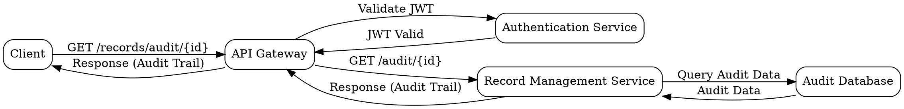

Here’s a sequence diagram for the "Get Record Audit Trail" API (`GET /records/audit/{id}`) using Graphviz Dot Language:

This sequence diagram shows the flow of data and authentication steps required to retrieve the audit trail of a specific record.
___

Here's the sequence diagram for the "Get All Audit Trails" API using Graphviz Dot Language:

```dot
digraph GetAllAuditTrails {
    rankdir=LR;
    node [shape=rect];

    User -> "API Gateway" [label="GET /records/audit"];
    "API Gateway" -> "Audit Controller" [label="Validate JWT and Forward Request"];
    "Audit Controller" -> "Audit Service" [label="Process Request"];
    "Audit Service" -> "Audit Repository" [label="Fetch Audit Trail Data"];
    "Audit Repository" -> "Database" [label="Execute Query"];
    "Database" -> "Audit Repository" [label="Return Audit Data"];
    "Audit Repository" -> "Audit Service" [label="Return Processed Data"];
    "Audit Service" -> "Audit Controller" [label="Return Response"];
    "Audit Controller" -> "API Gateway" [label="Send Response"];
    "API Gateway" -> User [label="Return Audit Trails"];
}
```

This diagram outlines the flow of the "Get All Audit Trails" request, illustrating how it passes through the system components, including authentication and data processing steps.
___

